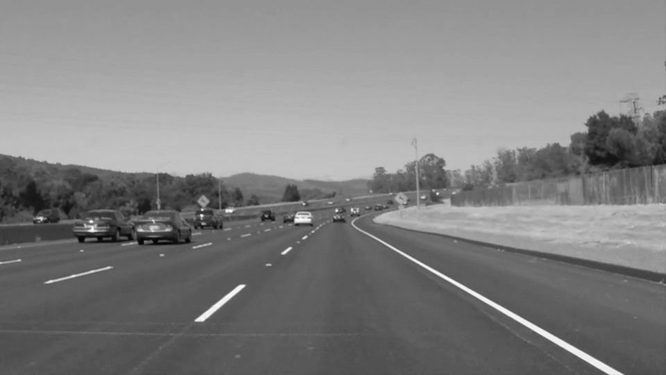
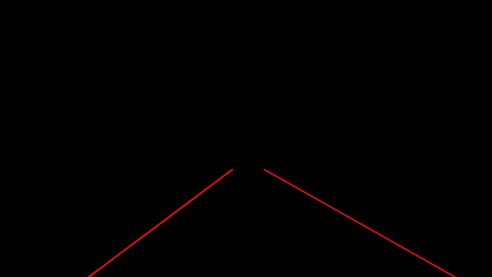
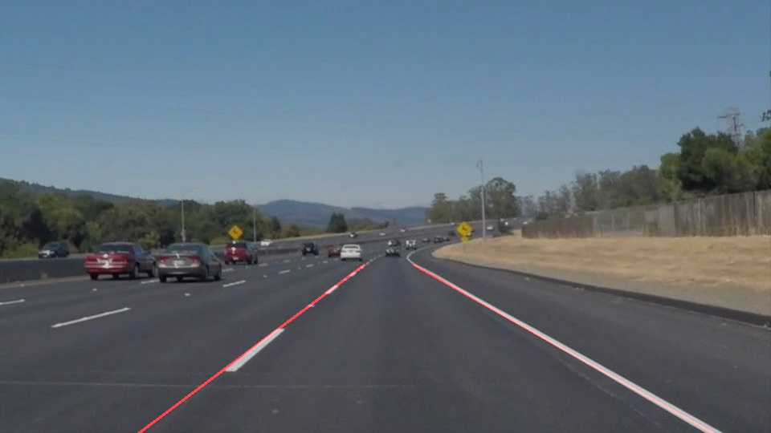

# **Finding Lane Lines on the Road** 

The goals / steps of this project are the following:
* Make a pipeline that finds lane lines on the road
* Reflect on your work in a written report

---

### Reflection

### 1. Pipeline 

My pipeline consisted of 5 steps. 
1. Convert the image into a grayscale image and smoothen it. 
2. Detecting edges using Canny edge detection algorithm.
3. Remove non interesting regions in the resulting image.
4. Apply Hough Transform to identify lines, calculate average line and extrapolate to cover whole region of interest
5. Overlapping it on the image to visually verify the results.

Pictorially the steps can be seen as follows:

**Original Image**  

**Grayscale Image**  

**Canny Edges**  

**Non Interesting Regions Removed**  

**Hough transform**  

**Final Overlapped Image**  

### 2. draw_lines() function
In order to draw a single line on the left and right lanes, I modified the draw_lines() function. Instead of drawing all the lines that are found, now I divide the lines which are found into two subsets; left and right on basis of their slopes as follows:
*Lines with slopes between 0.2 and 0.8 are considered part of left group, and, 
*lines with slopes -0.2 and -0.8 are considered as part of right group. 

The lines whose slope does not fall in these regions are discarded.

After this, I calculate the mean value for slope and intercept for each subset and use these values to determine the coordinates of where these average lines will intercept the boundaries of region of interest and using these coordinates, I draw the lane lines. 

### 2. Identify potential shortcomings with your current pipeline

One potential shortcoming in this approach is that occurrence of high frequency noise, such as tree shadows and reflections generate false line detections resulting in visibly wrong mean lines. Also irrelevant markings on the road are categorized as a potential line and results in skewed mean for lane lines. 

### 3. Suggest possible improvements to your pipeline

A possible improvement would be to use two, non overlapping regions of interest so as not to allow false detected lines to skew lane lines too much. Currently the only way to distinguish between left line and right line is on basis of slope only. This can be optimized by assigning a separate region of interest for both left and right lines. This way, if a line with similar slope to left lane line, is found in right portion of the image it will be safely ignored and will not skew the left lane line toward right. And vice versa.   

Another potential improvement could be to use time based hysteresis. Currently I am analyzing each frame independently, irrespective of the scenario shown in the previous frames. This can be changed to include the hysterical values of slopes and intercepts for mean calculation. This would effectively eliminate the high frequency noise that is present in only a couple of frames and then gone.
