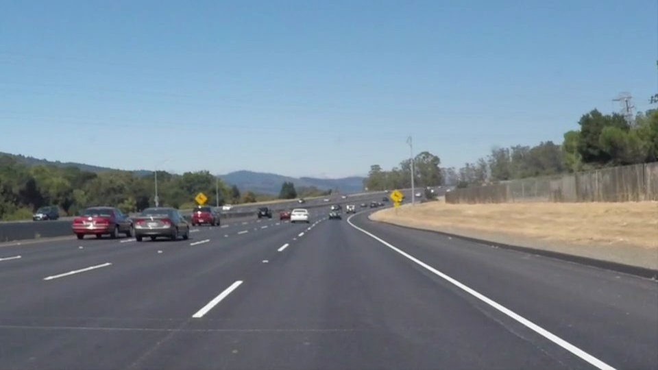
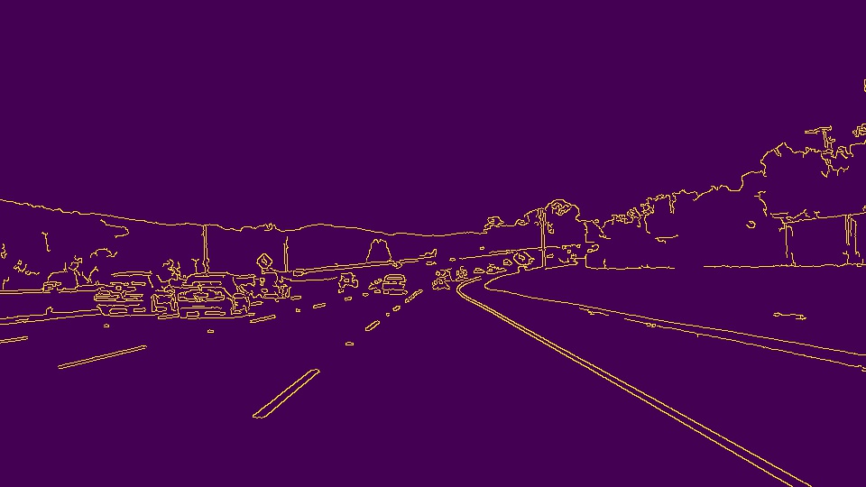

# **Finding Lane Lines on the Road** 

The goals / steps of this project are the following:
* Make a pipeline that finds lane lines on the road
* Reflect on your work in a written report

---

### Reflection

### 1. Pipeline 

My pipeline consisted of 5 steps. 
1. Convert the image into a grayscale image and smoothen it. 
2. Detecting edges using Canny edge detection algorithm.
3. Remove non interesting regions in the resulting image.
4. Apply Hough Transform to identify lines.
5. Overlapping it on the image to visually verify the results.

Pictorially the steps can be seen as follows:

**Original Image**

**Grayscale Image**

**Canny Edges**

**Non Interesting Regions Removed**

**Hough transform**

**Final Overlapped Image**

### 2. draw_lines() function
In order to draw a single line on the left and right lanes, I modified the draw_lines() function by ...

### 2. Identify potential shortcomings with your current pipeline

One potential shortcoming would be what would happen when ... 

Another shortcoming could be ...

### 3. Suggest possible improvements to your pipeline

A possible improvement would be to ...

Another potential improvement could be to ...
